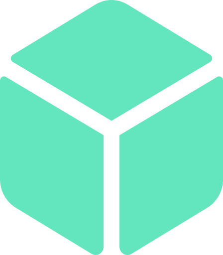

# Burguer 

## Resumo

Neste projeto de [Hamburgueria](https://ezequiel-lee.github.io/burguer-lee/) temos uma interface responsiva e com leves animações onde o cliente pode fazer seu pedido quando o estabelecimento estiver aberto. O pedido do cliente é enviado direto para o estabelecimento via API WhatsApp, a empresa escolhe o seu horário de funcionamento e mostra na página se esta aberto ou fechado.  
Também foi usado keyframes para uma interface com leves animações (fadeIn, fadeInUp, Down e Left)  
(Eu fiz pequenas melhorias no projeto que foi ensinado pelo Matheus no canal [Sujeito Programador](https://www.youtube.com/watch?v=rjXXDv23-6Y))

# Tecnologias e Framework utilizados

 
  
	
  
  

# Ferramentas utilizadas

 
  
  

Ícones do Font Awesome e animações com Animate.css e WOW.js

## Veja o funcionamento
### Desktop

Neste GIF animado, você pode conferir o projeto no Desktop em pleno funcionamento e responsivo.

### Mobile

Neste GIF animado, você pode conferir o projeto no Mobile em pleno funcionamento e responsivo.

## Acesse o Projeto

Você pode acessar o projeto através do link abaixo:

➜ [Link do Projeto](https://ezequiel-lee.github.io/burguer-lee/)
