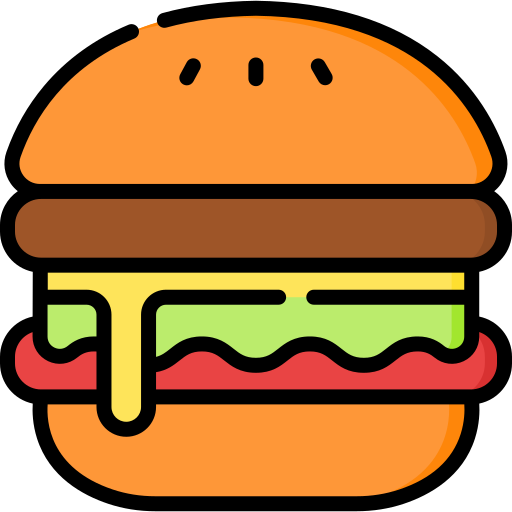
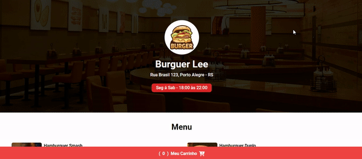
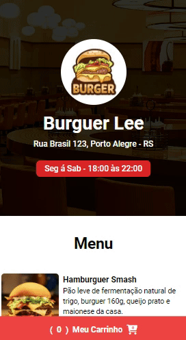

# Burguer! 
## Resumo:

Neste projeto de [Hamburgueria](https://ezequiel-lee.github.io/burgueria/) temos uma interface responsiva e com leves animações onde o cliente pode fazer seu pedido quando o estabelecimento estiver aberto. O pedido do cliente é enviado direto para o estabelecimento via API WhatsApp, a empresa escolhe o seu horário de funcionamento e mostra na página se esta aberto ou fechado.  
Também foi usado keyframes para uma interface com leves animações (fadeIn, fadeInUp, Down e Left)  
(Eu também adicionei pequenas melhorias e modifiquei outras. Projeto ensinado pelo Matheus no canal [Sujeito Programador](https://www.youtube.com/watch?v=rjXXDv23-6Y))

## Tecnologias - Framework - Ferramentas!
### Tecnologias:

  
  
  
  

## Ferramentas utilizadas!
### Ferramentas:

  
  

Ícones do Font Awesome e animações com Animate.css e WOW.js

## Veja o funcionamento!
### Desktop:

Neste GIF animado, você pode conferir o projeto no Desktop em pleno funcionamento e responsivo.

### Mobile:

Neste GIF animado, você pode conferir o projeto no Mobile em pleno funcionamento e responsivo.

## Acesse o Projeto!

Você pode acessar o projeto através do link abaixo:

➜ [Link do Projeto](https://ezequiel-lee.github.io/burgueria/)
